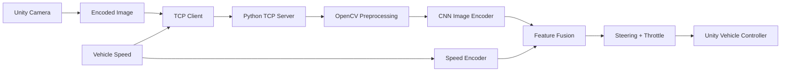

# SelfDriving-Simulator

### End-to-End Driving Policy with PyTorch and Unity


A **solo learning/reproduction project** based on NVIDIA's *End to End Learning for Self-Driving Cars*.

The project trains a modified Dave-2-style convolutional network that consumes a front-facing RGB image together with current vehicle speed and predicts:

- steering;
- throttle.

The trained PyTorch model is then connected to a Unity driving simulation through a small TCP inference server.

## Demo

[](https://www.youtube.com/watch?v=v07TapYTM1Y)

[**Watch the Unity driving demo**](https://www.youtube.com/watch?v=v07TapYTM1Y)

---

## System Overview



The repository contains both the **offline training pipeline** and the **runtime inference bridge**.

---

## Dataset Pipeline

Training data is organized around a CSV log with these fields:

```text
Image
Speed
Steering
Throttle
```

### Session Merge

`data_merge.py` combines multiple recorded driving sessions into one dataset:

1. Finds session directories.
2. Reads each session's `log.csv`.
3. Copies image files into `Merged_DataSet`.
4. Concatenates rows into a merged `log.csv`.

### Manual Data Inspection

`main.py` provides a small OpenCV visualization utility for inspecting recorded samples.

For each frame it overlays:

- steering value;
- a line indicating steering direction.

This is useful for checking whether image/label pairs are plausible before training.

---

## Training Pipeline

The training code is implemented in `train.py` with a custom PyTorch `Dataset`.

### Image Preprocessing

Each frame is:

1. loaded with OpenCV;
2. converted from BGR to RGB;
3. resized to `200 × 66`;
4. normalized to `[0, 1]`;
5. transposed from HWC to CHW;
6. converted to a `float32` PyTorch tensor.

Vehicle speed is normalized as:

```text
normalized_speed = speed / 100
```

### Data Augmentation

Each sample has a 50% probability of horizontal flipping.

When an image is flipped, steering is also inverted:

```text
image = horizontal_flip(image)
steering = -steering
```

Throttle remains unchanged.

### Train / Validation Split

The current script uses an **80 / 20 random split** of the full dataset.

Current training settings:

| Parameter | Value |
|---|---|
| Batch size | 64 |
| Epochs | 40 |
| Learning rate | `1e-4` |
| Loss | Mean Squared Error |
| Optimizer | Adam |
| Device | CUDA when available, otherwise CPU |

---

## Model Architecture

The network is a modified Dave-2-style model with separate image and speed branches.

### Image Encoder

Input:

```text
3 × 66 × 200 RGB image
```

Convolution stack:

```text
Conv2d  3 → 24   kernel 5  stride 2  + ELU
Conv2d 24 → 36   kernel 5  stride 2  + ELU
Conv2d 36 → 48   kernel 5  stride 2  + ELU
Conv2d 48 → 64   kernel 3  stride 1  + ELU
Conv2d 64 → 64   kernel 3  stride 1  + ELU
```

The resulting feature map is flattened to:

```text
1152 image features
```

### Speed Encoder

```text
1 speed value
    ↓
Linear 1 → 16
    ↓
ELU
```

### Feature Fusion

```text
1152 image features
+ 16 speed features
        ↓
      1168
        ↓
Linear 1168 → 100 + ELU
Linear  100 →  50 + ELU
Linear   50 →  10 + ELU
Linear   10 →   2
        ↓
[steering, throttle]
```

---

## Runtime Inference

`driver.py` runs a TCP server on:

```text
127.0.0.1:9999
```

The current wire format is:

```text
4-byte little-endian image length
        ↓
encoded image bytes
        ↓
4-byte little-endian float speed
        ↓
PyTorch inference
        ↓
ASCII response: "steering,throttle\n"
```

### Runtime Processing

For each incoming frame the server:

1. receives and decodes the image;
2. converts BGR → RGB;
3. resizes to `200 × 66`;
4. normalizes pixel values;
5. normalizes speed using the same `/ 100` rule as training;
6. performs inference with `torch.no_grad()`;
7. returns steering and throttle to Unity.

---

## Repository Structure

```text
SelfDriving-Simulator/
├── train.py          # Dataset, model, train/validation loop
├── driver.py         # TCP inference server used by Unity
├── data_merge.py     # Merge multiple recorded sessions
├── main.py           # Visual inspection of logged driving data
├── models/           # Model checkpoints
├── requirements.txt
└── README.md
```

---

## Setup

Install dependencies:

```bash
pip install -r requirements.txt
```

The repository currently contains Windows-specific absolute paths in the dataset utilities. Before training, update:

```python
BASE_PATH = r"..."
```

in `train.py`, and the source / merged dataset paths in `data_merge.py`.

### Train

```bash
python train.py
```

### Run the Inference Server

Before inference, make sure the checkpoint path in `driver.py` points to the model you want to use.

```bash
python driver.py
```

Then start the Unity-side client that sends camera images and speed values to `127.0.0.1:9999`.

---

## Current Code Notes

The repository is intentionally presented as a learning/reproduction project rather than original autonomous-driving research.

A few implementation details are worth noting:

- `train.py` currently saves the final model state as `best_model.pth`; it does not select a checkpoint by minimum validation loss.
- `driver.py` currently loads `models/best_model_v3.pth`, so the training output and inference checkpoint path should be aligned manually.
- The train and validation subsets wrap the same `DriveDataset`, whose `__getitem__` performs random horizontal flipping. As written, augmentation can therefore also occur during validation.
- Dataset locations are hard-coded local paths rather than command-line/configuration parameters.
- The TCP implementation reads the image payload in a loop, but the 4-byte header and speed value use single `recv(4)` calls. A production protocol should use an exact-length receive helper for all fixed-size fields.
- Evaluation is simulation-only; there is no object detection, localization, mapping, or motion-planning module.

---

## What This Project Demonstrates

- PyTorch model implementation
- Custom `Dataset` / `DataLoader` usage
- Image preprocessing with OpenCV
- Data augmentation and supervised training
- Train/validation loss tracking
- Multi-input feature fusion
- Simulator-to-ML-process integration
- TCP framing and real-time inference

---

## Reference

Mariusz Bojarski et al., **End to End Learning for Self-Driving Cars**, NVIDIA.

[arXiv:1604.07316](https://arxiv.org/abs/1604.07316)

---

## Author

**Dohun Lee**

[GitHub](https://github.com/vbn930)
